  

  undergraduate at UIUC Grainger College of Engineering

  Building intelligent for utility, entertainment, and the occasional emotional plot twist.

  

  
<code>signal_2711</code>

   
  
<code>the interesting part usually starts after “what if?”</code>

<!-- signal received. no further instructions. -->
<!-- profile signal refreshed. -->
<!-- profile index refreshed via git. -->
